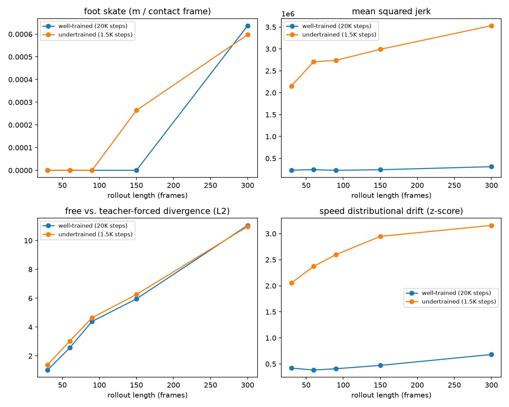

# flowmotion-horizon

[](https://github.com/oliverdippel/flowmotion-horizon/actions/workflows/ci.yml)
[](LICENSE)

flowmotion-horizon trains a conditional flow-matching model for human motion on AMASS
and evaluates it with a horizon-stability harness: matched free and teacher-forced
autoregressive rollouts from held-out subjects, scored by foot skate, jerk,
distributional drift, and free-vs-teacher-forced divergence as a function of rollout
length. The model exists to give the harness something to evaluate against; the
harness, not the model, is the deliverable.

## Problem

Motion-generation models are usually evaluated on short rollouts, where autoregressive
error has not yet compounded. A model that looks correct for 30 frames and diverges by
90 will pass a visual check and fail in deployment. This repository treats rollout
length as an evaluation axis instead of a fixed setting: every metric is computed at
several lengths, and the resulting curve — not a single-length number — is what the
harness reports.

Two rollouts are compared at each length:

- **free** — each predicted window is fed back in as the next conditioning window
  (standard autoregressive generation).
- **teacher-forced** — the same model, same seed window, same RNG state, but
  conditioned on real data at every step instead of its own output.

Both start from the same real seed window and consume the same noise draws (a
`torch.Generator` seeded identically for both, consumed in the same order). Their
divergence in world joint-position space isolates compounding self-conditioning
error, since that's the only thing differing between the two runs.

## Method

**Model** (`src/flowmotion/model/`): a rectified-flow / conditional flow-matching
velocity field. Given a target window `x1` and Gaussian noise `x0` of the same shape,
the training pair is `x_t = (1-t) x0 + t x1`, `u_t = x1 - x0` for `t ~ U(0,1)`, and the
network `v_theta` is trained to regress `u_t` from `(x_t, t, past, subject, action)`
under MSE loss (`model/flow_matching.py`). Sampling integrates `dx/dt = v_theta(x, t,
...)` from `t=0` to `t=1` with fixed-step Euler (10 steps by default; `rollout.py`).

`v_theta` (`model/network.py`, `VelocityTransformer`) is a bidirectional
`nn.TransformerEncoder` over a token sequence `[t, subject, action, past_0..K-1,
target_0..H-1]` (length `3+K+H`, `K=H=10` by default). Time is a sinusoidal embedding
through a small MLP; subject and action are learned embeddings with a null token and
training-time dropout (`model/conditioning.py`), so a held-out subject — never in the
training vocabulary — is conditioned on the null embedding instead of raising an
out-of-vocabulary error. Conditioning is injected as extra tokens, not AdaLN
modulation, which keeps the implementation to a stock encoder rather than a custom
transformer block.

**Pose representation**: AMASS SMPL+H `poses` are sliced to the root + 21 body joints
(hands dropped) and converted from axis-angle to 6D continuous rotations (Zhou et al.,
CVPR 2019) — axis-angle has a discontinuity near ±π that makes it a poor regression
target for a velocity field. Each frame is a 135-dim vector: 22 joints × 6D + 3D root
translation. Root translation is recentered per window (subtract the window's
first-frame x, y) before z-scoring.

**Data** (`src/flowmotion/data/`): `loader.py` reads AMASS's native
`<dataset>/<subject>/<sequence>.npz` layout; `synthetic.py` generates fixtures with the
identical layout and key contract, so tests and the `demo` command run without AMASS.
`dataset.py` builds a `MotionWindowDataset` whose window index is computed from
file-header metadata alone (sequence length, framerate) — no sequence is loaded until
one of its windows is requested, and loaded sequences sit in a bounded LRU cache
(`cache_size`), so training on a multi-GB corpus doesn't require holding it all in
memory. The subject/held-out split (`split_subjects`) operates on the set of unique
subjects, not sequences, so a subject with many sequences can't leak across the split.

**Evaluation** (`src/flowmotion/eval/`): for each held-out subject, `harness.py` runs
matched free/teacher-forced rollouts at several lengths and computes:

- `foot_skate` — horizontal displacement of a foot joint during frames classified as
  ground contact (height near a calibrated floor, low vertical velocity).
- `mean_squared_jerk` — third derivative of joint position; a smoothness proxy.
- `distributional_drift` — z-score of the rollout's trailing-window speed/acceleration
  against real held-out reference statistics.
- `rollout_divergence` — per-frame L2 distance between the free and teacher-forced
  trajectories.

All four are computed from joint positions produced by forward kinematics
(`data/skeleton.py`) over a fixed, hand-specified skeleton — there is no real SMPL body
model in this repository (see Limitations).

## Repository structure

```
src/flowmotion/
  model/            velocity network, label embeddings, flow-matching loss
  data/             AMASS loader, synthetic fixture generator, rotation conversions,
                    skeleton + forward kinematics, windowed dataset, normalization
  eval/             metrics, evaluation harness, multi-process eval, CSV/JSON/plot output
  rollout.py        Euler ODE integration, free and teacher-forced rollout
  viz.py            renders a free-vs-teacher-forced comparison as a GIF
  train.py          training loop, checkpointing, and distributed (DDP) support
  cli.py            `flowmotion` command-line entry point
tests/              47 tests: rotation-matrix round-trips, forward-kinematics
                    correctness, subject-split leakage, each metric against a
                    hand-constructed sequence with a known answer, rollout shapes,
                    parallel-vs-serial eval agreement, and an end-to-end smoke test
scripts/            standalone analysis scripts, not part of the installed package
assets/             example outputs referenced under Results
```

## Installation

Requires Python ≥3.10. Dependency resolution and the CPU-only PyTorch wheel index are
both handled by `uv` (configured in `pyproject.toml`):

```bash
uv sync --extra dev
```

## Usage

Without any data:

```bash
uv run flowmotion demo --out ./runs/demo
```

generates a synthetic fixture, trains a small model for 200 steps, runs the eval
harness, and writes `runs/demo/eval_report/horizon_curves.png`.

The individual stages:

```bash
uv run flowmotion prepare-fixture --out ./data/synthetic_amass
uv run flowmotion train --data-root ./data/synthetic_amass --out ./runs/tiny --steps 500
uv run flowmotion eval --checkpoint ./runs/tiny/model.pt --data-root ./data/synthetic_amass \
    --lengths 30,60,90,150,300 --out-dir ./runs/tiny/eval_report
uv run flowmotion rollout --checkpoint ./runs/tiny/model.pt --data-root ./data/synthetic_amass \
    --subject Dataset0/subject00 --length 90 --out ./runs/tiny/rollout.npz
uv run flowmotion visualize --checkpoint ./runs/tiny/model.pt --data-root ./data/synthetic_amass \
    --subject Dataset0/subject00 --length 90 --out ./runs/tiny/rollout.gif
```

With real AMASS data: download SMPL+H body-pose data from
https://amass.is.tue.mpg.de (registration and license acceptance happen on their
site; this repository does not automate that), extract each dataset archive into one
directory so the layout is `<root>/<dataset>/<subject>/<sequence>.npz`, then pass
`--data-root /path/to/amass` or set `AMASS_ROOT`. No code path differs between the
synthetic fixture and real data — `discover_sequences`/`load_sequence` read both
identically.

## Scaling

**Parallel evaluation.** `flowmotion eval --workers N` shards held-out sequences
across `N` processes (`eval/parallel.py`), each reloading the checkpoint independently
and running the same trial logic as the single-process path (`eval/harness.py`'s
`_run_trials`). Per-trial RNG seeds are derived from trial identity — subject,
sequence, seed index, rollout length — via `zlib.crc32`, not from iteration order, so
results don't depend on how trials are partitioned; `tests/test_eval_parallel.py`
checks the parallel and serial paths agree exactly. Measured on the 3,121-trial, 20
subject evaluation above: 14:07 at `--workers 1` vs. 7:20 at `--workers 8` (11-core
CPU) — a real but sub-linear speedup, since reference-statistic computation happens
once up front (not parallelized) and sequences are partitioned round-robin without
accounting for how many trials each one contributes.

**Distributed training.** `train()` checks for `WORLD_SIZE`/`RANK`/`LOCAL_RANK` (the
environment variables `torchrun` sets) rather than taking a separate flag, so the same
`flowmotion train` command runs single-process or multi-process depending on how it's
launched:

```bash
torchrun --standalone --nproc_per_node=4 -m flowmotion.cli train --data-root /path/to/amass --out ./runs/ddp
```

When `WORLD_SIZE > 1`, the model is wrapped in `DistributedDataParallel`, the dataset
uses a `DistributedSampler` (with `set_epoch` called at each epoch boundary), the
backend is `nccl` on CUDA and `gloo` otherwise, and only rank 0 logs and writes the
checkpoint (saved with `DistributedDataParallel`'s wrapper stripped, so it loads the
same way as a single-process checkpoint). Effective batch size is `batch_size ×
world_size`; `lr` is not auto-scaled.

This was verified with 2 CPU processes over the `gloo` backend (`torch.distributed`
requires no GPU to function correctly) — both ranks participate in the forward/backward
pass, only rank 0 produces output, the resulting checkpoint loads and runs normally.
It has not been run on multiple GPUs or multiple machines; no such hardware was
available while building this. On the development machine used here, `torchrun`'s own
rendezvous agent did not complete startup (a sandboxing/hostname-resolution
interaction, not a `torch.distributed` issue — `dist.init_process_group` itself
succeeds immediately when the standard `torchrun` environment variables are set
directly), so the 2-process verification launched two `flowmotion train` processes
with `RANK`/`WORLD_SIZE`/`MASTER_ADDR`/`MASTER_PORT` set manually rather than through
`torchrun`. `torchrun` is the documented way to launch this; the manual form is a
fallback for environments where its rendezvous agent doesn't complete startup.

## Configuration

`TrainConfig` (`train.py`) and `EvalConfig` (`eval/harness.py`) are plain dataclasses.
The parameters worth knowing about:

| Parameter | Default | Notes |
|---|---|---|
| `K`, `H` | 10, 10 | past-window / target-window length in frames at 20 fps; `K == H` so a predicted window can be fed straight back in as the next past window |
| `stride` | 5 | window stride when building the training index |
| `d_model`, `n_layers`, `n_heads` | 256, 4, 4 | transformer size |
| `p_label_dropout` | 0.1 | probability of replacing subject/action with the null token during training |
| `held_out_frac` | 0.15 | fraction of unique subjects held out, not sequences |
| `cache_size` | 64 | resident sequences in the dataset's LRU cache; raise above your total sequence count for a real corpus (the run below used 3500) |
| `rollout_lengths` | `[30, 60, 90, 150, 300]` | evaluated per held-out subject; a length longer than a given sequence is skipped and recorded, not silently dropped |
| `seeds_per_subject` | 2 | non-overlapping seed windows per sequence |
| `ode_steps` | 10 | Euler steps at sampling time |

## Implementation notes

- **Matched RNG between free and teacher-forced rollouts.** Both use a fresh
  `torch.Generator` seeded identically before each trial and consume it in the same
  order (one noise draw per window). The two trajectories are therefore identical up
  to the point where the free rollout starts conditioning on its own output, which is
  exactly what the divergence metric isolates.
- **Sampling runs under `torch.no_grad()`.** `integrate_velocity` never needs
  gradients — it's pure inference — so the ODE loop is wrapped accordingly rather than
  building an autograd graph on every rollout call.
- **Normalizer `eps` is set in feature units, not as a division-by-zero guard.**
  `Normalizer.fit`/`fit_streaming` floor per-channel std at `eps=1e-2`. Some joints
  (the spine) barely rotate across a typical AMASS corpus, so their raw std can be
  orders of magnitude smaller than the O(1) scale of the rotation-6D/translation
  features; flooring at a feature-scale value rather than a numerically-minimal one
  keeps those channels from being amplified disproportionately during normalization.
- **Foot-contact floor is calibrated from data, not assumed.** `estimate_foot_floor`
  takes the 1st percentile of a foot joint's height across real held-out sequences and
  uses that as "ground," instead of assuming world-height 0. The latter holds for the
  synthetic fixture by construction but not for this repository's fixed skeleton on
  real geometry, where a foot joint's true resting height is a few tenths of a meter
  above 0.
- **Subject-level, not sequence-level, splitting.** `split_subjects` operates on the
  set of unique `subject_key`s, so a subject with many sequences can't have some in
  train and others held out. `tests/test_dataset_split.py` checks this directly.

## Results

Trained on 7 AMASS sub-datasets (ACCAD, BMLhandball, BMLmovi, HumanEva, MPI_HDM05,
SFU, TotalCapture — 3,026 sequences, 135 subjects, 115 train / 20 held out):

```bash
uv run flowmotion train --data-root /path/to/amass --out ./runs/real_v2 \
    --steps 20000 --batch-size 64 --cache-size 3500 --d-model 384 --n-layers 6 --n-heads 6
uv run flowmotion eval --checkpoint ./runs/real_v2/model.pt --data-root /path/to/amass \
    --lengths 30,60,90,150,300 --seeds-per-subject 3 --out-dir ./runs/real_v2/eval_report
```

~42 minutes to train on CPU. Training loss: 2.24 → ~0.28.


Evaluated on all 20 held-out subjects (3,121 trials): free-vs-teacher-forced
divergence grows with rollout length — 1.02 → 2.56 → 4.39 → 5.95 → 11.05 across
lengths 30/60/90/150/300 — the behavior the harness is built to detect. Foot-skate and
jerk have wide variance at this scale: the held-out pool is small relative to how
rarely a foot is classified as in ground contact.


**Ablation.** Same command as above with `--steps 1500` in place of `20000`,
otherwise identical (same data, architecture, seed — so the held-out split is
unchanged). Comparing the two models' evaluations on the same held-out set:



| Metric (mean across lengths) | 20K steps | 1.5K steps | ratio |
|---|---|---|---|
| jerk (mean squared) | ~2.5×10⁵ | ~2.8×10⁶ | ~11× |
| distributional drift (speed z-score) | ~0.47 | ~2.6 | ~5.6× |
| free-vs-teacher-forced divergence (range) | 1.02–11.05 | 1.38–10.98 | ~1.0–1.35× |

Jerk and distributional drift separate the two models cleanly at every rollout length.
Divergence — the metric this repository is built around — does not: both models
converge to nearly the same value by length 300. At this scale, divergence appears to
track rollout length more than training quality; jerk and drift are the more sensitive
indicators here. This is reported as observed on this run, not as a general claim
about the metric.

## Limitations

- **No real SMPL body model.** `betas`-conditioned shape is license-gated separately
  from AMASS mocap data. `skeleton.py` uses a fixed, hand-specified bone-offset
  template instead of a per-subject shape, so absolute joint positions are
  approximate. The evaluation metrics are relative (degradation vs. rollout length, or
  deviation from a calibrated reference), which is largely insensitive to this, but
  the output should not be read as calibrated geometry.
- **Joint parent topology** follows the standard SMPL kinematic tree but has not been
  cross-checked against a canonical joint table with a real body model.
- **Root canonicalization** is per-window x, y recentering, not full yaw alignment
  (rotating each window to face a fixed direction, as in HuMoR/MDM-style pipelines).
- **Single noise seed per divergence trial** — not averaged over multiple draws.
- **Held-out set size.** 20 subjects is enough for the divergence-vs-length trend to
  be visible but not for per-metric confidence intervals; foot-skate in particular has
  few ground-contact frames at this scale.
- 10-step Euler integration and the `p_label_dropout=0.1` / `held_out_frac=0.15`
  defaults are standard choices, not tuned against a validation objective.

## Citation

AMASS's license requires citing it if you use the data:

> Mahmood, N., Ghorbani, N., Troje, N. F., Pons-Moll, G., & Black, M. J. (2019). AMASS:
> Archive of Motion Capture as Surface Shapes. *ICCV*.

This repository: see `CITATION.cff`.
