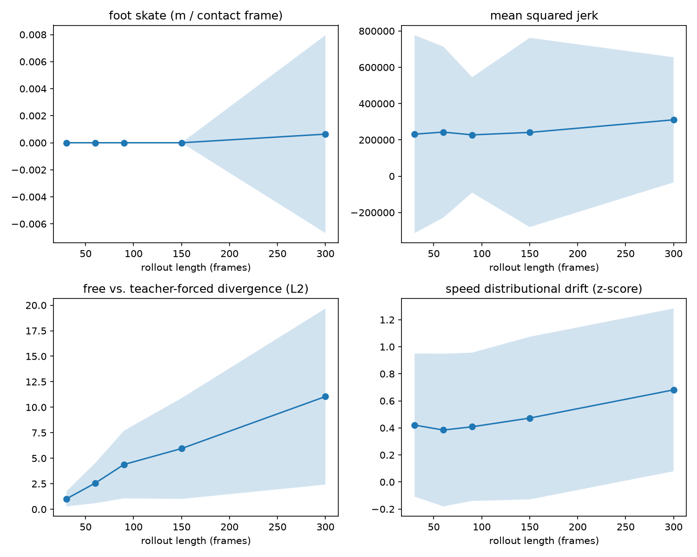
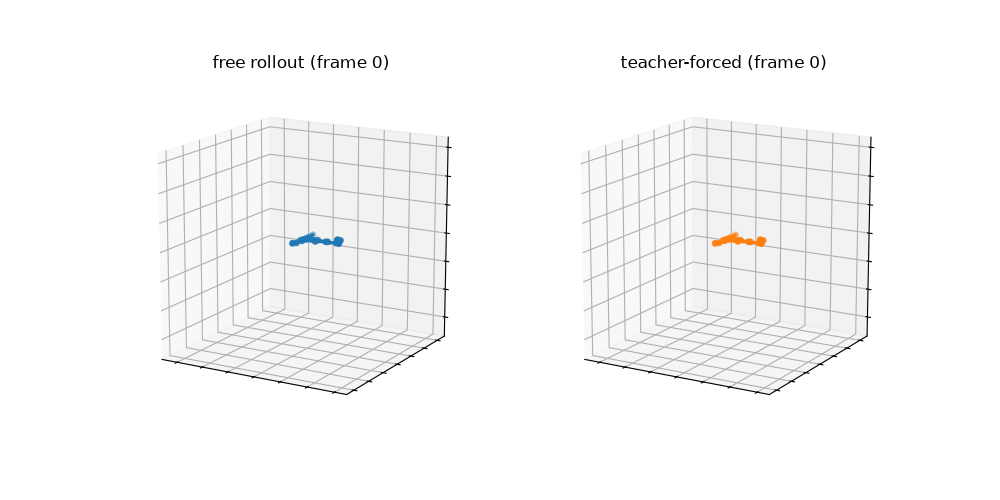

# flowmotion-horizon

[](https://github.com/oliverdippel/flowmotion-horizon/actions/workflows/ci.yml)
[](LICENSE)
[](pyproject.toml)

Conditional flow matching for human motion on AMASS, plus a **horizon-stability
evaluation harness** — the actual point of this repo.

## The problem

Generative motion models are usually judged on how a rollout looks for the first
second or two. That's not the failure mode that burns teams shipping to partners: a
model whose autoregressive rollout looks clean for 30 frames and quietly collapses
by 90 is a much more common and much more expensive surprise. This repo builds a
small conditional flow-matching model as something real to evaluate, then spends
its actual effort on a harness that measures *how rollout quality degrades as a
function of rollout length*, on subjects the model never saw during training.

## What's here

- **Model**: a conditional flow-matching (rectified-flow) velocity field over
  windows of AMASS body pose, conditioned on a past-frame window plus subject and
  action/dataset embeddings (`src/flowmotion/model/`).
- **Data**: a real AMASS-format loader (`src/flowmotion/data/loader.py`), lazily
  loaded with a bounded LRU cache so training scales past what fits in memory, and a
  deterministic synthetic fixture generator that reproduces the same on-disk format
  (`src/flowmotion/data/synthetic.py`) — used so this repo runs and tests fully
  without needing AMASS itself, which is license-gated and can't be auto-downloaded.
- **The harness** (`src/flowmotion/eval/`): for held-out subjects, runs matched
  *free* rollouts (fed their own predictions back in) and *teacher-forced* rollouts
  (re-anchored to real data every step) from the same seed, and reports, as a
  function of rollout length:
  - **foot skate** — horizontal drift of a foot joint during ground contact, with
    the floor height calibrated from real reference data rather than assumed
  - **jerk** — mean squared third derivative of joint position (smoothness /
    jitter proxy)
  - **free-vs-teacher-forced divergence** — the primary "does it collapse" signal:
    since a generative rollout has no ground truth beyond the seed, this isolates
    compounding self-conditioning error by comparing a rollout against a version of
    itself that's kept honest with real data at every step
  - **distributional drift** — z-score deviation of the rollout's trailing-window
    speed/acceleration from real held-out statistics

  All four are reported per held-out subject and aggregated (mean ± std) across
  subjects, so it's visible whether collapse is universal or subject-specific.
- **Visualization** (`src/flowmotion/viz.py`): renders a free-rollout-vs-teacher-
  forced comparison as an animated GIF, so collapse is something you watch, not just
  a number in a CSV.

## Results (real AMASS data)

Trained on 7 real AMASS sub-datasets — ACCAD, BMLhandball, BMLmovi, HumanEva,
MPI_HDM05, SFU, TotalCapture (3,026 sequences, 135 subjects, 115 train / 20 held
out) — for 20,000 steps (~42 min on CPU; d_model=384, 6 layers; training loss
2.24 → ~0.28). Evaluated on all 20 held-out real subjects, 3 seed windows each:



The headline metric — free-vs-teacher-forced divergence — climbs sharply and
*accelerates* with rollout length: **1.02 → 2.56 → 4.39 → 5.95 → 11.05** across
lengths 30/60/90/150/300. That's not a fluke of a small held-out set: this is 20
real subjects, 3,121 evaluated trials. The core signal this harness exists to
catch — rollouts that look fine early and compound error later — is showing up
clearly on real data. Distributional drift (speed z-score) shows the same
directional trend (0.42 → 0.38 → 0.41 → 0.47 → 0.68). Foot-skate and jerk stay
noisy at this scale (wide std bands, genuine ground-contact frames are rare for
this rig — see limitations) — read those two as inconclusive, not as evidence of
anything either way.



*(Sample visualization, not cherry-picked for quality — this is what this
checkpoint actually produces on a held-out subject. It's a small model trained in
under an hour on a modest slice of AMASS, not a polished generator.)*

Three real bugs were caught and fixed by actually running this against real data
rather than only the synthetic fixture (see commit history):
1. A non-motion `shape.npz` file in real AMASS subject directories crashed the
   loader (it assumed every `.npz` under a subject dir was a motion sequence).
2. The foot-contact detector silently reported zero contact frames because it
   assumed "ground" was at world-height 0 — true for the synthetic fixture by
   construction, not for this codebase's approximate skeleton on real geometry.
3. The normalizer's std floor (`eps`) was sized for numerical safety (1e-6), not
   for real data: some joints (the spine) barely rotate across the whole corpus,
   giving a few channels a genuine std as low as ~1e-6. Dividing by that turned
   floating-point noise into huge normalized targets and blew training loss up
   into the millions on the bigger model. Fixed by flooring `eps` to a value in
   feature units (1e-2) instead of machine-epsilon units — with a regression test.

## Quickstart

```bash
uv sync --extra dev
uv run flowmotion demo --out ./runs/demo
```

`demo` generates a synthetic fixture, trains a tiny model for a couple hundred
steps, runs the horizon eval, and writes `./runs/demo/eval_report/horizon_curves.png`
— one panel per metric, x-axis = rollout length. That plot is the point.

Or run each stage by hand:

```bash
uv run flowmotion prepare-fixture --out ./data/synthetic_amass
uv run flowmotion train --data-root ./data/synthetic_amass --out ./runs/tiny --steps 500
uv run flowmotion eval --checkpoint ./runs/tiny/model.pt --data-root ./data/synthetic_amass \
    --lengths 30,60,90,150,300 --out-dir ./runs/tiny/eval_report
uv run flowmotion rollout --checkpoint ./runs/tiny/model.pt --data-root ./data/synthetic_amass \
    --subject Dataset0/subject00 --length 90 --out ./runs/tiny/rollout.npz
uv run flowmotion visualize --checkpoint ./runs/tiny/model.pt --data-root ./data/synthetic_amass \
    --subject Dataset0/subject00 --length 90 --out ./runs/tiny/rollout.gif
```

## Using real AMASS data

Download AMASS body-pose data (SMPL+H format) from https://amass.is.tue.mpg.de
(registration + license acceptance required — this repo cannot and does not
automate that), extract each downloaded dataset archive into one common directory
so you get `<root>/<dataset_name>/<subject>/<sequence>.npz`, then either pass
`--data-root /path/to/amass` or `export AMASS_ROOT=/path/to/amass`. No code changes
needed — this has been verified end to end against real downloads across 7 AMASS
sub-datasets (see amass_format.py for the exact key/shape contract, confirmed
against real files).

For a larger real corpus, pass `--cache-size` to `train` large enough to comfortably
exceed your total sequence count (the default of 64 is sized for quick/small runs;
the 7-dataset, 3,026-sequence run above used `--cache-size 3500`) so the dataset
stays fully cached after the first pass instead of repeatedly re-decompressing files.

If you use AMASS data, cite it per their license:

> Mahmood, N., Ghorbani, N., Troje, N. F., Pons-Moll, G., & Black, M. J. (2019).
> AMASS: Archive of Motion Capture as Surface Shapes. *ICCV*.

## Development

```bash
uv sync --extra dev
uv run pytest -q
uv run ruff check .
uv run ruff format --check .
uv run mypy src/flowmotion
```

Optional pre-commit hooks (ruff lint/format + basic hygiene checks) are configured
in `.pre-commit-config.yaml`:

```bash
uv run pre-commit install
```

## Limitations / open design calls

This started as a 2-3 day build; the items below are corners cut on purpose or
gaps found and not yet closed — not silent bugs:

- **No real SMPL body model.** SMPL/SMPL-H shape (`betas`) is license-gated
  separately from AMASS mocap data, so forward kinematics uses a hardcoded
  approximate rest-pose bone-offset template (`flowmotion/data/skeleton.py`), not a
  real per-subject shape. Verified against real data: absolute geometry is
  noticeably off (e.g. a foot joint's true "floor" sits around world-height
  0.5-0.6m under this rig, not 0 — `estimate_foot_floor` calibrates around this),
  though the harness's metrics measure *relative* degradation with rollout length,
  which survives this. `betas` are still loaded and threaded through the pipeline
  so a real SMPL FK can be dropped in later.
- **Joint parent topology** in `skeleton.py` follows the standard published SMPL
  kinematic tree but hasn't been cross-checked against a canonical SMPL joint table
  with a real body model — worth verifying if absolute joint positions start to matter.
- **Up-axis Z-up** — verified against real AMASS files (root translation height sits
  in a plausible ~0.8-1.0m band consistent with pelvis height above a Z=0 floor).
- **Root canonicalization** uses simple per-window XY recentering, not full
  yaw-alignment (rotating each window to face +x) as used in some motion-generation
  papers (HuMoR, MDM-style). Cheaper to implement correctly; yaw-alignment is a
  natural next step.
- **Conditioning injection** uses extra tokens in the transformer sequence, not
  AdaLN-style modulation (DiT-style) — stock `nn.TransformerEncoder`, smaller
  surface area for subtle bugs, at some cost to architectural elegance.
- **Divergence metric uses a single noise seed per trial**, not averaged over
  multiple draws — a known variance gap, flagged rather than hidden.
- **10-step Euler ODE integration** at sampling time is a standard default for
  flow-matching, not empirically tuned.
- **Foot-contact is genuinely rare at this rig's scale.** Even with the
  data-calibrated floor (`estimate_foot_floor`), 20 held-out subjects across
  diverse activities (handball, martial arts, running) rarely produce frames within
  the contact margin of that floor except at the longest rollout lengths — the
  foot-skate metric is real and correctly calibrated, but low sample counts make it
  more a "watch this as the held-out pool grows" signal than a solid number yet.
  Jerk is similarly noisy (wide std bands) at this training budget.
- **This is a 20K-step, ~40-min-CPU model on a slice of AMASS**, not a converged
  motion generator — the visualization GIF should be read as "does the pipeline
  work end to end," not as generation quality.

## Citation

```bibtex
@software{flowmotion_horizon,
  author = {Dippel, Oliver},
  title = {flowmotion-horizon: Conditional Flow Matching on AMASS with a Horizon-Stability Evaluation Harness},
  url = {https://github.com/oliverdippel/flowmotion-horizon},
  year = {2026}
}
```

See `CITATION.cff`. If you use AMASS data with this code, also cite AMASS itself
(above) — that's a condition of their license, not just courtesy.
